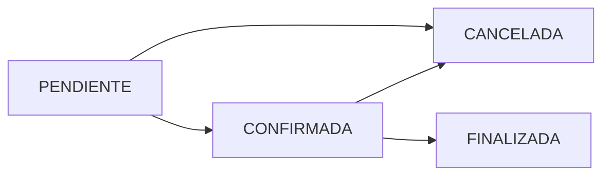

## Overview

This endpoint allows administrative staff to update an appointment's status. Common use cases include confirming pending appointments, cancelling appointments, or marking them as finalized after the doctor completes the consultation.

<Note>
  This endpoint requires authentication with `auth:sanctum` middleware. Typically restricted to administrative staff and doctors.
</Note>

## Path Parameters

<ParamField path="id" type="integer" required>
  Appointment ID (`ID_CITAS`) to update
</ParamField>

## Request Body

<ParamField body="estado" type="string" required>
  New appointment status. Must be one of:
  - `PENDIENTE` - Pending confirmation (default state)
  - `CONFIRMADA` - Confirmed and ready for patient visit
  - `CANCELADA` - Cancelled (frees up the time slot)
  - `FINALIZADA` - Completed with medical consultation recorded
</ParamField>

<Warning>
  Setting status to `FINALIZADA` should typically be done through the [Complete Consultation](/api/doctors/complete-consultation) endpoint, which also records medical notes, diagnosis, and prescriptions.
</Warning>

## Response Fields

<ResponseField name="message" type="string" required>
  Success message confirming the status update with the new status value
</ResponseField>

## Request Examples

### Confirm an Appointment

```bash
curl -X PUT https://api.vitafem.com/api/admin/citas/45/estado \
  -H "Authorization: Bearer YOUR_TOKEN" \
  -H "Content-Type: application/json" \
  -H "Accept: application/json" \
  -d '{
    "estado": "CONFIRMADA"
  }'
```

### Cancel an Appointment

```bash
curl -X PUT https://api.vitafem.com/api/admin/citas/45/estado \
  -H "Authorization: Bearer YOUR_TOKEN" \
  -H "Content-Type: application/json" \
  -H "Accept: application/json" \
  -d '{
    "estado": "CANCELADA"
  }'
```

### Mark as Finalized

```bash
curl -X PUT https://api.vitafem.com/api/admin/citas/45/estado \
  -H "Authorization: Bearer YOUR_TOKEN" \
  -H "Content-Type: application/json" \
  -H "Accept: application/json" \
  -d '{
    "estado": "FINALIZADA"
  }'
```

## Response Example

```json
{
  "message": "Estado de la cita actualizado a: CONFIRMADA"
}
```

## Implementation Details

### Database Update

The endpoint updates the `ESTADO` field in the `CITAS` table:

```php
Cita::where('ID_CITAS', $id)
    ->orWhere('id_citas', $id)
    ->update(['ESTADO' => $nuevoEstado]);
```

### Oracle Compatibility

Handles both uppercase and lowercase column names for Oracle Database compatibility:

```php
->orWhere('id_citas', $id) // Fallback for lowercase
```

## Status Transitions

### Valid Status Flows



### State Descriptions

<AccordionGroup>
  <Accordion title="PENDIENTE → CONFIRMADA">
    Administrative staff reviews the appointment request and confirms it's scheduled correctly. The patient may receive a confirmation notification.
  </Accordion>
  
  <Accordion title="PENDIENTE/CONFIRMADA → CANCELADA">
    Patient requests cancellation, or staff cancels due to doctor unavailability. This frees up the time slot for other patients. Cancelled appointments are excluded from availability calculations.
  </Accordion>
  
  <Accordion title="CONFIRMADA → FINALIZADA">
    Doctor completes the consultation and records medical notes. Prefer using the [Complete Consultation](/api/doctors/complete-consultation) endpoint which also saves diagnosis, prescriptions, and vital signs.
  </Accordion>
</AccordionGroup>

## Error Responses

### Appointment Not Found (No Error)

<Info>
  The current implementation doesn't explicitly check if the appointment exists. An update on a non-existent ID will succeed but affect 0 rows.
</Info>

### Internal Error (500)

```json
{
  "error": "Error al cambiar estado: SQLSTATE[HY000]: General error"
}
```

## Business Logic Considerations

### When Cancelling Appointments

<Check>
  **Time Slot Release**: Cancelled appointments (`ESTADO = 'CANCELADA'`) are automatically excluded from the [Available Slots](/api/appointments/available-slots) calculation, making the time available for rebooking.
</Check>

### When Confirming Appointments

<Steps>
  <Step title="Verify Doctor Availability">
    Check the doctor's schedule hasn't changed before confirming
  </Step>
  
  <Step title="Send Notification">
    Consider sending a confirmation email or SMS to the patient
  </Step>
  
  <Step title="Update Calendar">
    Synchronize with the clinic's calendar system if integrated
  </Step>
</Steps>

### When Finalizing Appointments

<Warning>
  Directly setting status to `FINALIZADA` without recording medical data is not recommended. Use the [Complete Consultation](/api/doctors/complete-consultation) endpoint instead, which:
  - Records vital signs (weight, height, temperature, blood pressure)
  - Saves diagnosis and treatment instructions
  - Creates prescriptions with medication details
  - Automatically updates status to `FINALIZADA`
</Warning>

## Use Cases

<CardGroup cols={2}>
  <Card title="Appointment Confirmation" icon="check">
    Secretary confirms appointments in bulk after reviewing the daily schedule
  </Card>
  
  <Card title="Cancellation Management" icon="times">
    Handle patient cancellations and doctor availability changes
  </Card>
  
  <Card title="Administrative Corrections" icon="pen">
    Fix incorrectly marked appointments or revert status changes
  </Card>
  
  <Card title="Workflow Automation" icon="robot">
    Integrate with automated systems for appointment reminders and confirmations
  </Card>
</CardGroup>

## Rate Limiting Considerations

<Info>
  Since this endpoint modifies appointment states, consider implementing:
  - Rate limiting to prevent abuse
  - Audit logging to track who changed appointment statuses
  - Confirmation dialogs for irreversible actions (especially cancellations)
</Info>

## Related Endpoints

- [List Appointments](/api/appointments/list) - View all appointments with current status
- [Complete Consultation](/api/doctors/complete-consultation) - Proper way to finalize appointments with medical data
- [My Appointments](/api/appointments/my-appointments) - Patient view of their appointments