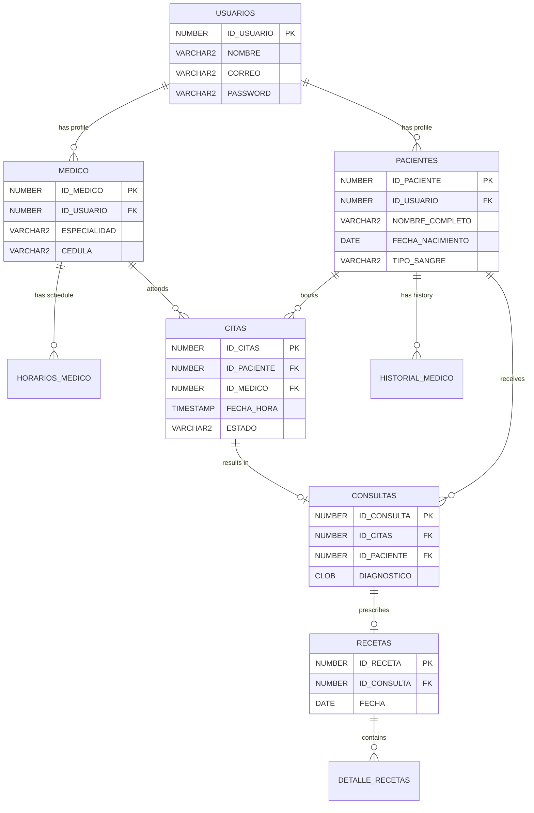

## Overview

VitaFem uses **Oracle Database** with the **Yajra Laravel-OCI8** driver to manage healthcare data. The schema follows Oracle naming conventions with uppercase table and column names.

<Info>
  **Package Used**: `yajra/laravel-oci8` - Oracle OCI8 driver for Laravel's Eloquent ORM
</Info>

## Database Configuration

### Connection Setup

The Oracle connection is defined in `config/database.php`:

```php config/database.php
'connections' => [
    'oracle' => [
        'driver'         => 'oracle',
        'tns'            => env('DB_TNS', ''),
        'host'           => env('DB_HOST', ''),
        'port'           => env('DB_PORT', '1521'),
        'database'       => env('DB_DATABASE', ''),
        'username'       => env('DB_USERNAME', ''),
        'password'       => env('DB_PASSWORD', ''),
        'charset'        => env('DB_CHARSET', 'AL32UTF8'),
        'prefix'         => env('DB_PREFIX', ''),
        'prefix_schema'  => env('DB_SCHEMA_PREFIX', ''),
        'edition'        => env('DB_EDITION', 'ora$base'),
        'server_version' => env('DB_SERVER_VERSION', '11g'),
    ],
],

'default' => env('DB_CONNECTION', 'mysql'), // Change to 'oracle' in production
```

### Environment Variables

```bash .env
DB_CONNECTION=oracle
DB_HOST=your-oracle-host.com
DB_PORT=1521
DB_DATABASE=VITAFEM
DB_USERNAME=your_username
DB_PASSWORD=your_password
DB_CHARSET=AL32UTF8
```

## Oracle-Specific Model Configuration

All Eloquent models must be configured for Oracle compatibility:

```php Model Template
use Illuminate\Database\Eloquent\Model;

class ExampleModel extends Model
{
    // Required for Oracle
    protected $table = 'UPPERCASE_TABLE_NAME';      // Oracle table name
    protected $primaryKey = 'ID_FIELD';              // Primary key column
    public $sequence = 'SEQ_TABLE_NAME';             // Oracle sequence for auto-increment
    public $timestamps = false;                      // Disable Laravel timestamps

    // Fillable columns (Oracle column names)
    protected $fillable = [
        'COLUMN_1',
        'COLUMN_2',
    ];
}
```

<Warning>
  **Important**: Oracle uses sequences instead of auto-increment. Every model must define the `$sequence` property for insert operations to work correctly.
</Warning>

## Core Models & Tables

### User Model

Manages system users (patients, doctors, admins).

```php app/Models/User.php
class User extends Authenticatable
{
    use HasApiTokens, HasFactory, Notifiable;

    protected $table = 'USUARIOS';
    protected $primaryKey = 'ID_USUARIO';
    public $sequence = 'SEQ_USUARIOS';
    public $timestamps = false;

    protected $fillable = [
        'NOMBRE',
        'CORREO',
        'PASSWORD',
        'ACTIVO',
        'FOTO_PERFIL',
    ];

    protected $hidden = [
        'PASSWORD',
    ];

    // Custom password field for Oracle
    public function getAuthPassword()
    {
        return $this->password;
    }
}
```

**Table: USUARIOS**

| Column | Type | Description |
|--------|------|-------------|
| `ID_USUARIO` | NUMBER | Primary key (auto-generated via sequence) |
| `NOMBRE` | VARCHAR2 | User's full name |
| `CORREO` | VARCHAR2 | Email address (unique) |
| `PASSWORD` | VARCHAR2 | Hashed password (bcrypt) |
| `ACTIVO` | CHAR(1) | Active status ('1' = active, '0' = inactive) |
| `FOTO_PERFIL` | VARCHAR2 | Profile photo URL |

### Paciente Model

Patient demographic and medical information.

```php app/Models/Paciente.php
class Paciente extends Model
{
    protected $table = 'PACIENTES';
    protected $primaryKey = 'ID_PACIENTE';
    public $sequence = 'SEQ_PACIENTES';
    public $timestamps = false;

    protected $fillable = [
        'NOMBRE_COMPLETO',
        'FECHA_NACIMIENTO',
        'SEXO',
        'ALERGIAS_PRINCIPALES',
        'CORREO',
        'TELEFONO',
        'TIPO_SANGRE',
        'ID_USUARIO'
    ];
}
```

**Table: PACIENTES**

| Column | Type | Description |
|--------|------|-------------|
| `ID_PACIENTE` | NUMBER | Primary key |
| `NOMBRE_COMPLETO` | VARCHAR2 | Patient's full name |
| `FECHA_NACIMIENTO` | DATE | Date of birth |
| `SEXO` | CHAR(1) | Gender ('M'/'F') |
| `ALERGIAS_PRINCIPALES` | VARCHAR2 | Known allergies |
| `CORREO` | VARCHAR2 | Email address |
| `TELEFONO` | VARCHAR2 | Phone number |
| `TIPO_SANGRE` | VARCHAR2 | Blood type (e.g., 'O+', 'A-') |
| `ID_USUARIO` | NUMBER | Foreign key to USUARIOS |

### Medico Model

Doctor profiles and specializations.

```php app/Models/Medico.php
class Medico extends Model
{
    protected $table = 'MEDICO';
    protected $primaryKey = 'ID_MEDICO';
    public $sequence = 'SEQ_MEDICOS';
    public $timestamps = false;

    protected $fillable = [
        'ID_USUARIO',
        'ESPECIALIDAD',
        'CEDULA',
        'BIO'
    ];

    // Relationships
    public function usuario()
    {
        return $this->belongsTo(User::class, 'ID_USUARIO', 'ID_USUARIO');
    }

    public function horarios()
    {
        return $this->hasMany(HorarioMedico::class, 'ID_MEDICO', 'ID_MEDICO');
    }
}
```

**Table: MEDICO**

| Column | Type | Description |
|--------|------|-------------|
| `ID_MEDICO` | NUMBER | Primary key |
| `ID_USUARIO` | NUMBER | Foreign key to USUARIOS |
| `ESPECIALIDAD` | VARCHAR2 | Medical specialty (e.g., 'Ginecología', 'Obstetricia') |
| `CEDULA` | VARCHAR2 | Professional license number |
| `BIO` | CLOB | Doctor's biography |

### Cita Model

Appointment scheduling and management.

```php app/Models/Cita.php
class Cita extends Model
{
    protected $table = 'CITAS';
    protected $primaryKey = 'ID_CITAS';
    public $sequence = 'SEQ_CITAS';
    public $timestamps = false;

    protected $casts = [
        'FECHA_HORA' => 'datetime',
    ];

    protected $fillable = [
        'ID_PACIENTE',
        'ID_MEDICO',
        'ID_USUARIO_REGISTRO',
        'FECHA_HORA',
        'ESTADO',
        'MOTIVO',
        'NOTAS_MEDICAS'
    ];

    // Relationships
    public function medico()
    {
        return $this->belongsTo(Medico::class, 'ID_MEDICO', 'ID_MEDICO');
    }

    public function paciente()
    {
        return $this->belongsTo(Paciente::class, 'ID_PACIENTE', 'ID_PACIENTE');
    }

    public function consulta()
    {
        return $this->hasOne(Consulta::class, 'ID_CITAS', 'ID_CITAS');
    }
}
```

**Table: CITAS**

| Column | Type | Description |
|--------|------|-------------|
| `ID_CITAS` | NUMBER | Primary key |
| `ID_PACIENTE` | NUMBER | Foreign key to PACIENTES |
| `ID_MEDICO` | NUMBER | Foreign key to MEDICO |
| `ID_USUARIO_REGISTRO` | NUMBER | User who created the appointment |
| `FECHA_HORA` | TIMESTAMP | Appointment date and time |
| `ESTADO` | VARCHAR2 | Status: 'PROGRAMADA', 'COMPLETADA', 'CANCELADA' |
| `MOTIVO` | VARCHAR2 | Reason for visit |
| `NOTAS_MEDICAS` | CLOB | Doctor's notes |

### Consulta Model

Medical consultation records.

```php app/Models/Consulta.php
class Consulta extends Model
{
    protected $table = 'CONSULTAS';
    protected $primaryKey = 'ID_CONSULTA';
    public $sequence = 'SEQ_CONSULTAS';
    public $timestamps = false;

    protected $fillable = [
        'ID_CITAS',
        'ID_PACIENTE',
        'PESO',
        'ALTURA',
        'TEMPERATURA',
        'PRESION_ARTERIAL',
        'SINTOMAS_SUBJETIVOS',
        'EXPLORACION_FISICA',
        'DIAGNOSTICO',
        'TRATAMIENTO_INDICACIONES'
    ];

    // Relationships
    public function cita()
    {
        return $this->belongsTo(Cita::class, 'ID_CITAS', 'ID_CITAS');
    }

    public function paciente()
    {
        return $this->belongsTo(Paciente::class, 'ID_PACIENTE', 'ID_PACIENTE');
    }

    public function receta()
    {
        return $this->hasOne(Receta::class, 'ID_CONSULTA', 'ID_CONSULTA');
    }
}
```

**Table: CONSULTAS**

| Column | Type | Description |
|--------|------|-------------|
| `ID_CONSULTA` | NUMBER | Primary key |
| `ID_CITAS` | NUMBER | Foreign key to CITAS |
| `ID_PACIENTE` | NUMBER | Foreign key to PACIENTES |
| `PESO` | NUMBER | Weight (kg) |
| `ALTURA` | NUMBER | Height (cm) |
| `TEMPERATURA` | NUMBER | Body temperature (°C) |
| `PRESION_ARTERIAL` | VARCHAR2 | Blood pressure (e.g., '120/80') |
| `SINTOMAS_SUBJETIVOS` | CLOB | Patient-reported symptoms |
| `EXPLORACION_FISICA` | CLOB | Physical examination findings |
| `DIAGNOSTICO` | CLOB | Medical diagnosis |
| `TRATAMIENTO_INDICACIONES` | CLOB | Treatment plan |

### Receta Model

Prescription management.

```php app/Models/Receta.php
class Receta extends Model
{
    protected $table = 'RECETAS';
    protected $primaryKey = 'ID_RECETA';
    public $sequence = 'SEQ_RECETAS';
    public $timestamps = false;

    protected $fillable = [
        'ID_CONSULTA',
        'FECHA'
    ];

    public function consulta()
    {
        return $this->belongsTo(Consulta::class, 'ID_CONSULTA', 'ID_CONSULTA');
    }

    public function detalles()
    {
        return $this->hasMany(DetalleReceta::class, 'ID_RECETA', 'ID_RECETA');
    }
}
```

**Table: RECETAS**

| Column | Type | Description |
|--------|------|-------------|
| `ID_RECETA` | NUMBER | Primary key |
| `ID_CONSULTA` | NUMBER | Foreign key to CONSULTAS |
| `FECHA` | DATE | Prescription date |

### DetalleReceta Model

Individual prescription items.

```php app/Models/DetalleReceta.php
class DetalleReceta extends Model
{
    protected $table = 'DETALLE_RECETAS';
    protected $primaryKey = 'ID_DETALLE';
    public $sequence = 'SEQ_DETALLE_RECETAS';
    public $timestamps = false;

    protected $fillable = [
        'ID_RECETA',
        'MEDICAMENTO',
        'DOSIS',
        'FRECUENCIA',
        'DURACION'
    ];

    public function receta()
    {
        return $this->belongsTo(Receta::class, 'ID_RECETA', 'ID_RECETA');
    }
}
```

**Table: DETALLE_RECETAS**

| Column | Type | Description |
|--------|------|-------------|
| `ID_DETALLE` | NUMBER | Primary key |
| `ID_RECETA` | NUMBER | Foreign key to RECETAS |
| `MEDICAMENTO` | VARCHAR2 | Medication name |
| `DOSIS` | VARCHAR2 | Dosage (e.g., '500mg') |
| `FRECUENCIA` | VARCHAR2 | Frequency (e.g., 'Every 8 hours') |
| `DURACION` | VARCHAR2 | Duration (e.g., '7 days') |

### HorarioMedico Model

Doctor availability schedules.

```php app/Models/HorarioMedico.php
class HorarioMedico extends Model
{
    protected $table = 'HORARIOS_MEDICO';
    protected $primaryKey = 'ID_HORARIO';
    public $sequence = 'SEQ_HORARIOS_MEDICO';
    public $timestamps = false;

    protected $fillable = [
        'ID_MEDICO',
        'DIA_SEMANA',      // 1=Monday, 7=Sunday
        'HORA_INICIO',
        'HORA_FIN',
        'DURACION_CITA'
    ];

    public function medico()
    {
        return $this->belongsTo(Medico::class, 'ID_MEDICO', 'ID_MEDICO');
    }
}
```

**Table: HORARIOS_MEDICO**

| Column | Type | Description |
|--------|------|-------------|
| `ID_HORARIO` | NUMBER | Primary key |
| `ID_MEDICO` | NUMBER | Foreign key to MEDICO |
| `DIA_SEMANA` | NUMBER | Day of week (1-7) |
| `HORA_INICIO` | VARCHAR2 | Start time (e.g., '09:00') |
| `HORA_FIN` | VARCHAR2 | End time (e.g., '17:00') |
| `DURACION_CITA` | NUMBER | Appointment duration (minutes) |

### HistorialMedico Model

Patient medical history.

```php app/Models/HistorialMedico.php
class HistorialMedico extends Model
{
    protected $table = 'HISTORIAL_MEDICO';
    protected $primaryKey = 'ID_HISTORIAL';
    public $sequence = 'SEQ_HISTORIAL';
    public $timestamps = false;

    protected $fillable = [
        'ID_PACIENTE',
        'TIPO_ANTECEDENTE',
        'DESCRIPCION'
    ];
}
```

**Table: HISTORIAL_MEDICO**

| Column | Type | Description |
|--------|------|-------------|
| `ID_HISTORIAL` | NUMBER | Primary key |
| `ID_PACIENTE` | NUMBER | Foreign key to PACIENTES |
| `TIPO_ANTECEDENTE` | VARCHAR2 | Type: 'PERSONAL', 'FAMILIAR', 'QUIRURGICO' |
| `DESCRIPCION` | CLOB | Detailed history |

## Entity Relationship Diagram



## Relationships Summary

<AccordionGroup>
  <Accordion title="One-to-Many Relationships">
    - **USUARIOS → PACIENTES**: One user can have one patient profile
    - **USUARIOS → MEDICO**: One user can have one doctor profile
    - **MEDICO → HORARIOS_MEDICO**: One doctor has many schedules
    - **MEDICO → CITAS**: One doctor attends many appointments
    - **PACIENTES → CITAS**: One patient books many appointments
    - **RECETAS → DETALLE_RECETAS**: One prescription has many medication items
  </Accordion>
  
  <Accordion title="One-to-One Relationships">
    - **CITAS → CONSULTAS**: One appointment results in one consultation
    - **CONSULTAS → RECETAS**: One consultation may produce one prescription
  </Accordion>
</AccordionGroup>

## Query Examples

### Eager Loading Relationships

Prevent N+1 query problems:

```php
// Load appointment with related doctor and patient info
$citas = Cita::with([
    'medico.usuario',
    'paciente',
    'consulta.receta.detalles'
])->get();
```

### Querying with Oracle Date Functions

```php
// Get today's appointments
$today = Cita::whereRaw("TRUNC(FECHA_HORA) = TRUNC(SYSDATE)")->get();

// Get appointments for a specific doctor this week
$appointments = Cita::where('ID_MEDICO', $medicoId)
    ->whereRaw("FECHA_HORA >= TRUNC(SYSDATE, 'IW')")
    ->whereRaw("FECHA_HORA < TRUNC(SYSDATE, 'IW') + 7")
    ->orderBy('FECHA_HORA')
    ->get();
```

### Creating Records with Sequences

```php
// Oracle sequence auto-generates ID
$paciente = Paciente::create([
    'NOMBRE_COMPLETO' => 'Jane Doe',
    'FECHA_NACIMIENTO' => '1990-05-15',
    'SEXO' => 'F',
    'TIPO_SANGRE' => 'O+',
    'ID_USUARIO' => $userId
]);

// The ID is automatically populated via SEQ_PACIENTES
echo $paciente->ID_PACIENTE; // e.g., 1523
```

## Database Migrations

<Warning>
  Laravel migrations work differently with Oracle. The Yajra OCI8 package provides Oracle-compatible migration methods.
</Warning>

```php Example Migration
use Illuminate\Database\Migrations\Migration;
use Illuminate\Database\Schema\Blueprint;
use Illuminate\Support\Facades\Schema;

class CreateCitasTable extends Migration
{
    public function up()
    {
        Schema::create('CITAS', function (Blueprint $table) {
            $table->id('ID_CITAS');
            $table->unsignedBigInteger('ID_PACIENTE');
            $table->unsignedBigInteger('ID_MEDICO');
            $table->timestamp('FECHA_HORA');
            $table->string('ESTADO', 20);
            $table->text('MOTIVO')->nullable();
            
            $table->foreign('ID_PACIENTE')
                  ->references('ID_PACIENTE')
                  ->on('PACIENTES');
            $table->foreign('ID_MEDICO')
                  ->references('ID_MEDICO')
                  ->on('MEDICO');
        });
        
        // Create sequence manually
        DB::statement('CREATE SEQUENCE SEQ_CITAS START WITH 1 INCREMENT BY 1');
    }

    public function down()
    {
        Schema::dropIfExists('CITAS');
        DB::statement('DROP SEQUENCE SEQ_CITAS');
    }
}
```

## Best Practices

<CardGroup cols={2}>
  <Card title="Use Sequences" icon="list-ol">
    Always define `$sequence` in models for auto-increment behavior
  </Card>
  <Card title="Eager Load Relations" icon="bolt">
    Use `with()` to avoid N+1 query problems
  </Card>
  <Card title="Uppercase Names" icon="arrow-up-a-z">
    Oracle requires uppercase table/column names
  </Card>
  <Card title="Disable Timestamps" icon="clock">
    Set `$timestamps = false` unless you have CREATED_AT/UPDATED_AT columns
  </Card>
</CardGroup>

<Note>
  For role-based access control and permission management, see [Roles & Permissions](/concepts/roles-permissions).
</Note>
